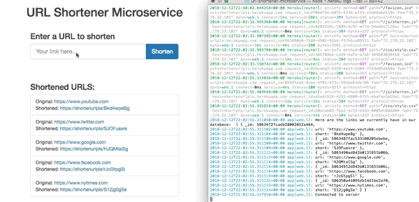

# url-shortener-microservice 

### A very basic URL shortening app using Node.js. Front-end rendered with embedded JavaScript. User submits a URL in a field, the Express server makes an Ajax POST submission to our 'api/shorten' endpoint, stores the URL in a database (MongoDB), and app returns a shortened URL using the 'shortid' npm package.

Try it out [here](https://shortenurlpls.herokuapp.com)

